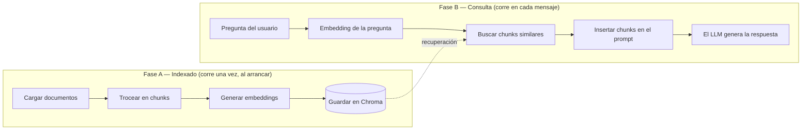

# Cómo funciona este chatbot RAG

Este documento recorre [`app.py`](../app.py) línea por línea, en el orden en que
realmente se ejecuta, para que puedas seguirlo mientras lees el código. No asume
conocimiento previo de RAG (retrieval-augmented generation / generación aumentada
por recuperación).

## El panorama general

Un LLM normal solo puede responder con lo que memorizó durante su entrenamiento — no
sabe nada sobre *ti* en particular. RAG soluciona esto entregándole al LLM un puñado
de fragmentos de texto relevantes de tus propios documentos justo antes de que
responda, dentro del mismo prompt. El LLM no se "entrena" con tus datos; simplemente
recibe la posibilidad de leer las partes relevantes en el momento de la consulta.

Eso significa que siempre hay dos fases separadas, y confundirlas es la fuente número
uno de confusión al aprender RAG:



En este código: **la Fase A es `build_vectorstore()`**, **la Fase B es `answer()`**.
Todo lo demás es cableado (wiring) para que esas dos piezas funcionen.

---

## Fase A — Indexado (`build_vectorstore`, [app.py:36](../app.py))

Corre exactamente una vez, cuando arranca la app (`main()` llama a `build_chain()`,
que llama a `build_vectorstore()`). El resultado — el vector store — queda en memoria
durante toda la vida del proceso, listo para ser consultado en cada mensaje.

### A1. Cargar documentos ([`load_documents`](../app.py), línea 26)

```python
for path in DATA_DIR.glob("**/*"):
    if path.suffix.lower() == ".pdf": ...
    elif path.suffix.lower() in {".md", ".txt"}: ...
```

Recorre `data/`, y para cada archivo elige un *loader* — una clase que sabe convertir
ese formato de archivo en objetos `Document` de LangChain (básicamente
`{page_content: str, metadata: dict}`). Ahora mismo, `data/about-nicolas.md` se
convierte en un solo `Document` grande. Si agregas un `.pdf`, `PyPDFLoader` convierte
cada página en su propio `Document`.

### A2. Trocear en chunks ([`RecursiveCharacterTextSplitter`](../app.py), línea 42)

```python
splitter = RecursiveCharacterTextSplitter(chunk_size=800, chunk_overlap=100)
chunks = splitter.split_documents(documents)
```

**¿Por qué trocear?** Dos razones:
1. Tanto los modelos de embeddings como la ventana de contexto del LLM tienen
   límites — no puedes simplemente entregar un libro entero.
2. Más importante aún: si embebes un documento gigante como un solo vector, ese
   vector es un promedio borroso de *todo* lo que contiene. Una pregunta sobre un
   párrafo específico no va a hacer buen match. Chunks pequeños y enfocados se
   embeben con más precisión.

`chunk_size=800` significa ~800 caracteres por chunk. `chunk_overlap=100` significa
que cada chunk repite los últimos 100 caracteres del anterior, para que una oración
que caiga justo en el límite entre dos chunks no se corte a la mitad y pierda
sentido en ambos pedazos. "Recursive" (recursivo) significa que primero intenta
cortar en saltos de párrafo, luego en oraciones, luego en palabras — y solo recurre a
un corte duro por cantidad de caracteres como último recurso — así los chunks tienden
a terminar en límites naturales en vez de a mitad de una palabra.

### A3. Generar embeddings de cada chunk ([`FastEmbedEmbeddings`](../app.py), línea 44)

```python
embeddings = FastEmbedEmbeddings(model_name=EMBEDDING_MODEL)
```

Un **embedding** es una lista de ~384 números (un vector) que representa el
*significado* de un fragmento de texto. Dos chunks sobre temas similares terminan con
vectores que apuntan en direcciones parecidas en ese espacio de 384 dimensiones — así
puedes medir "significado similar" como una distancia geométrica entre dos listas de
números.

`sentence-transformers/all-MiniLM-L6-v2` es el modelo específico que hace esta
conversión — una red neuronal pequeña entrenada justamente para que oraciones
semánticamente similares terminen cerca entre sí. FastEmbed corre este modelo vía
ONNX Runtime (un motor de inferencia liviano) en vez de PyTorch, exclusivamente para
que quepa en el límite de 512MB de RAM del free tier de Render — el mismo modelo,
mucho menos RAM.

Este paso corre **local y gratis** — nunca llama a una API externa. Eso es a
propósito: el embedding corre en cada arranque (y en una versión más avanzada de esta
app, cada vez que agregas un documento), así que mantenerlo gratis y rápido importa.
Solo la generación de la respuesta final (Fase B) llama a una API paga/con límite de
uso.

### A4. Guardar en Chroma ([`Chroma.from_documents`](../app.py), línea 45)

```python
return Chroma.from_documents(chunks, embeddings)
```

Chroma es una **base de datos vectorial**: guarda pares `(texto del chunk, vector de
embedding)` y, dado un vector nuevo, encuentra rápidamente los vectores guardados más
cercanos a él. Aquí se usa **solo en memoria** (no se pasa ninguna ruta de carpeta) —
todo se reconstruye desde `data/` en cada reinicio. Eso está bien a esta escala (un
solo archivo pequeño); un sistema en producción con miles de documentos guardaría el
índice en disco en vez de recalcularlo cada vez.

---

## Fase B — Consulta (`answer`, [app.py:56](../app.py))

Corre de cero por cada mensaje que envía el usuario. `make_answer_fn` es una fábrica
de *closures* — existe para que `answer()` pueda capturar `retriever` y `llm` sin que
sean variables globales (ver [app.py:55](../app.py)).

### B1. Embeber la pregunta y buscar chunks similares (línea 57)

```python
relevant_docs = retriever.invoke(message)
```

El retriever (creado en [app.py:50](../app.py) con `search_kwargs={"k": 4}`) genera
el embedding de la pregunta del usuario usando *ese mismo* modelo de embeddings de la
Fase A, y luego le pide a Chroma los **4 chunks** cuyos vectores están más cerca del
vector de la pregunta. Esto es **búsqueda semántica**, no búsqueda por palabras
clave — preguntar "¿a qué se dedica Nicolas?" puede hacer match con un chunk que dice
"Ingeniero en Informática" aunque no compartan ni una palabra.

`k=4` es un parámetro ajustable: muy bajo y puedes perderte el chunk que tiene la
respuesta; muy alto y diluyes el prompt con texto irrelevante (y pagas por más
tokens).

### B2. Insertar los chunks en el prompt (líneas 58–63)

```python
context = "\n\n".join(doc.page_content for doc in relevant_docs)
messages = [
    {"role": "system", "content": SYSTEM_PROMPT.format(context=context)},
    *history,
    {"role": "user", "content": message},
]
```

Esta es la mitad de "generación aumentada" del RAG. Los 4 chunks recuperados se
pegan dentro del system prompt (ver [app.py:18](../app.py)) — que le instruye
explícitamente al modelo que responda *solo* a partir de ese contexto y admita
cuando no sabe algo, en vez de inventar. Esa instrucción es lo que mantiene al bot
anclado a tu bio real en vez de alucinar (inventar cosas) o responder con lo que el
modelo base memorizó sobre "Nicolas" en general (nada, presumiblemente).

`*history` inserta los turnos previos de la conversación (Gradio los pasa
automáticamente porque se configuró `type="messages"` en `ChatInterface`), así el
modelo tiene contexto conversacional además de los chunks recuperados.

### B3. Generar la respuesta (línea 64)

```python
response = llm.invoke(messages)
```

Esta es la única llamada de red a un servicio pago/alojado en toda la solicitud —
todo lo anterior (embedding, búsqueda vectorial) corrió localmente. `llm` es un
cliente `ChatGroq` (línea 51) apuntando a `openai/gpt-oss-20b`, un modelo de pesos
abiertos que Groq aloja en hardware propio diseñado para inferencia muy rápida.
`temperature=0.2` mantiene las respuestas bastante deterministas/factuales en vez de
creativas — apropiado para un bot que "responde a partir de contexto".

---

## Todo lo demás en `app.py`

- **[`main()`](../app.py) (línea 70)**: construye la cadena una sola vez, envuelve
  `answer` en un `ChatInterface` de Gradio (que maneja la interfaz web y el historial
  de la conversación por ti), y levanta un servidor en `0.0.0.0` en el puerto que
  Render asigne vía la variable de entorno `PORT` — `0.0.0.0` (a diferencia de
  `127.0.0.1`) es lo que permite que tráfico desde fuera del contenedor llegue a la
  app.
- **[`load_dotenv()`](../app.py) (línea 12)**: lee `.env` localmente para que
  `GROQ_API_KEY` esté disponible vía `os.environ` — en producción, Render la inyecta
  directamente como variable de entorno real y esto se vuelve un no-op.
- **Por qué `build_chain`/`answer` no están a nivel de módulo**: importar `app.py`
  (por ejemplo para un test) intentaría de inmediato construir un cliente `ChatGroq`
  y fallaría sin una API key. Envolver todo en funciones hace que nada se ejecute
  hasta que `main()` sea realmente llamada.

---

## Siguiendo una solicitud real paso a paso

Digamos que escribes **"¿En qué proyectos ha trabajado Nicolas?"**:

1. `retriever.invoke(...)` genera el embedding de esa pregunta → un vector de 384
   números.
2. Chroma lo compara contra el vector de cada chunk de `data/about-nicolas.md` y
   devuelve los 4 más cercanos — casi seguro los chunks de la sección "Proyectos"
   (Medsoft, Your First Home, etc.), por ser el contenido semánticamente más cercano.
3. Esos 4 chunks se unen en `context` y se insertan en el system prompt.
4. La lista completa de mensajes (system prompt + contexto + tu pregunta) se envía a
   `openai/gpt-oss-20b` en Groq.
5. El modelo lee el contexto, resume los proyectos que menciona, y devuelve el
   texto — que Gradio renderiza en la ventana de chat.

Si preguntaras algo totalmente ajeno a la bio (ej. "¿cuál es la capital de Francia?"),
el paso 2 igual devolvería *algunos* 4 chunks (Chroma siempre devuelve tu `k` más
cercano, aunque sea mal match) — pero la instrucción del system prompt de "si la
respuesta no está en el contexto, di que no tienes esa información" es lo que evita
que el modelo responda igual con confianza usando su conocimiento general.

---

## Cosas para probar, para afianzar la intuición

Todos estos son cambios de una línea en `app.py` — cambia algo, reinicia
(`python app.py`), y observa qué pasa:

- **Bajar `k` a 1** ([app.py:50](../app.py)) — haz una pregunta cuya respuesta toque
  dos secciones distintas del documento. Observa cómo la respuesta empeora/queda
  incompleta porque el modelo solo ve un chunk.
- **Imprimir `context` antes de enviarlo** (agrega un `print(context)` dentro de
  `answer()`) — mira exactamente qué vio el modelo. Este es el hábito de debugging
  más útil en RAG: cuando el bot responde mal, la primera pregunta siempre es "¿se
  recuperó el contexto correcto?".
- **Achicar `chunk_size` a 200** ([app.py:42](../app.py)) — obtendrás más chunks,
  más pequeños; la recuperación se vuelve más precisa pero cada chunk tiene menos
  contexto alrededor, lo que puede perjudicar respuestas que necesitan un párrafo
  completo.
- **Agregar un segundo archivo a `data/`** (ej. tu CV real en `.pdf`) — no requiere
  cambios de código, solo reiniciar. Pregunta algo que solo esté en ese archivo nuevo.
- **Cambiar `temperature` a 1.0** ([app.py:51](../app.py)) — las respuestas se
  vuelven más variadas y menos literales, a veces a costa de la precisión.
