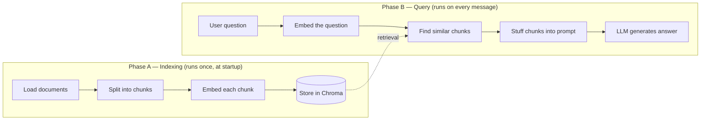

# How this RAG chatbot works

This walks through [`app.py`](../app.py) line by line, in the order things actually
execute, so you can follow along with the code while you read. It assumes no prior
RAG (retrieval-augmented generation) knowledge.

## The big picture

A plain LLM can only answer from what it memorized during training — it knows nothing
about *you* specifically. RAG fixes that by handing the LLM a stack of relevant text
snippets from your own documents right before it answers, in the prompt itself. The
LLM isn't "trained" on your data; it just gets to read the relevant bits at query time.

That means there are always two separate phases, and confusing them is the #1 source
of confusion when learning RAG:



In this codebase: **Phase A is `build_vectorstore()`**, **Phase B is `answer()`**.
Everything else is wiring.

---

## Phase A — Indexing (`build_vectorstore`, [app.py:36](../app.py))

Runs exactly once, when the app starts (`main()` calls `build_chain()` calls
`build_vectorstore()`). The result — the vector store — then sits in memory for the
whole lifetime of the process, ready to be searched on every message.

### A1. Load documents ([`load_documents`](../app.py), line 26)

```python
for path in DATA_DIR.glob("**/*"):
    if path.suffix.lower() == ".pdf": ...
    elif path.suffix.lower() in {".md", ".txt"}: ...
```

Walks `data/`, and for each file picks a *loader* — a class that knows how to turn
that file format into LangChain `Document` objects (basically `{page_content: str,
metadata: dict}`). Right now `data/about-nicolas.md` becomes one big `Document`.
Drop in a `.pdf` and `PyPDFLoader` turns each page into its own `Document`.

### A2. Split into chunks ([`RecursiveCharacterTextSplitter`](../app.py), line 42)

```python
splitter = RecursiveCharacterTextSplitter(chunk_size=800, chunk_overlap=100)
chunks = splitter.split_documents(documents)
```

**Why split at all?** Two reasons:
1. Embedding models and the LLM's context window both have limits — you can't just
   hand over an entire book.
2. More importantly: if you embed one giant document as a single vector, that vector
   is a blurry average of *everything* in it. A question about one specific paragraph
   won't match well. Small, focused chunks embed more precisely.

`chunk_size=800` means ~800 characters per chunk. `chunk_overlap=100` means each chunk
repeats the last 100 characters of the previous one, so a sentence that happens to
fall right on a chunk boundary doesn't get cut in half and lose meaning in both halves.
"Recursive" means it tries to split on paragraph breaks first, then sentences, then
words — only falling back to a hard character cut as a last resort — so chunks tend to
end at natural boundaries instead of mid-word.

### A3. Embed each chunk ([`FastEmbedEmbeddings`](../app.py), line 44)

```python
embeddings = FastEmbedEmbeddings(model_name=EMBEDDING_MODEL)
```

An **embedding** is a list of ~384 numbers (a vector) that represents the *meaning* of
a piece of text. Two chunks about similar topics end up with vectors that point in
similar directions in that 384-dimensional space — you can measure "similar meaning"
as a geometric distance between two lists of numbers.

`sentence-transformers/all-MiniLM-L6-v2` is the specific model that does this
conversion — a small neural network trained specifically so that semantically similar
sentences land near each other. FastEmbed runs this model via ONNX Runtime (a
lightweight inference engine) instead of PyTorch, purely so it fits Render's 512MB
free-tier memory limit — same model, much less RAM.

This step is **local and free** — it never calls an external API. That's deliberate:
embedding runs on every startup and (in a smarter version of this app) on every
document you add, so keeping it free and fast matters. Only the actual answer
generation (Phase B) calls a paid/rate-limited API.

### A4. Store in Chroma ([`Chroma.from_documents`](../app.py), line 45)

```python
return Chroma.from_documents(chunks, embeddings)
```

Chroma is a **vector database**: it stores `(chunk text, embedding vector)` pairs and,
given a new vector, quickly finds the stored vectors closest to it. Here it's used
**in-memory only** (no folder path passed) — everything is rebuilt from `data/` on
every restart. That's fine at this scale (one small file); a production system with
thousands of documents would persist the index to disk instead of recomputing it
every time.

---

## Phase B — Query (`answer`, [app.py:56](../app.py))

Runs fresh for every message the user sends. `make_answer_fn` is a closure factory —
it exists so `answer()` can close over `retriever` and `llm` without them being global
variables (see [app.py:55](../app.py)).

### B1. Embed the question and find similar chunks (line 57)

```python
relevant_docs = retriever.invoke(message)
```

The retriever (built at [app.py:50](../app.py) with `search_kwargs={"k": 4}`) embeds
the user's question using that *same* embedding model from Phase A, then asks Chroma
for the **4 chunks** whose vectors are closest to the question's vector. This is
**semantic search**, not keyword search — asking "what does Nicolas do for work?" can
match a chunk that says "Computer Engineer" even though no words overlap.

`k=4` is a tunable knob: too low and you might miss the chunk with the answer; too
high and you dilute the prompt with irrelevant text (and pay for more tokens).

### B2. Stuff the chunks into a prompt (lines 58–63)

```python
context = "\n\n".join(doc.page_content for doc in relevant_docs)
messages = [
    {"role": "system", "content": SYSTEM_PROMPT.format(context=context)},
    *history,
    {"role": "user", "content": message},
]
```

This is the "augmented generation" half of RAG. The 4 retrieved chunks get pasted
into the system prompt (see [app.py:18](../app.py)) — which explicitly instructs the
model to answer *only* from that context and admit when it doesn't know, instead of
guessing. That instruction is what keeps the bot grounded in your actual bio instead
of making things up (hallucinating) or answering from whatever the base model
memorized about "Nicolas" in general (nothing, presumably).

`*history` splices in the prior turns of the conversation (Gradio passes this in
automatically because `type="messages"` was set on `ChatInterface`), so the model has
conversational context too, not just the retrieved chunks.

### B3. Generate the answer (line 64)

```python
response = llm.invoke(messages)
```

This is the only network call to a paid/hosted service in the whole request —
everything before it (embedding, vector search) ran locally. `llm` is a `ChatGroq`
client (line 51) pointed at `openai/gpt-oss-20b`, an open-weight model Groq hosts on
custom hardware built for very fast inference. `temperature=0.2` keeps answers fairly
deterministic/factual rather than creative — appropriate for a "answer from context"
bot.

---

## Everything else in `app.py`

- **[`main()`](../app.py) (line 70)**: builds the chain once, wraps `answer` in a
  Gradio `ChatInterface` (handles the web UI and conversation history for you), and
  launches a server bound to `0.0.0.0` on whatever port Render assigns via the `PORT`
  env var — `0.0.0.0` (as opposed to `127.0.0.1`) is what lets traffic from outside
  the container reach it.
- **[`load_dotenv()`](../app.py) (line 12)**: reads `.env` locally so `GROQ_API_KEY`
  is available via `os.environ` — in production, Render injects it directly as a real
  environment variable and this becomes a no-op.
- **Why `build_chain`/`answer` aren't at module level**: importing `app.py` (e.g. for
  a test) would otherwise immediately try to build a `ChatGroq` client and fail
  without an API key. Wrapping it all in functions means nothing runs until `main()`
  is actually called.

---

## Trace one real request

Say you type **"What projects has Nicolas worked on?"**:

1. `retriever.invoke(...)` embeds that question → a 384-number vector.
2. Chroma compares it against every chunk's vector from `data/about-nicolas.md` and
   returns the 4 closest — almost certainly the "Projects" section chunks (Medsoft,
   Your First Home, etc.), since that's the semantically closest content.
3. Those 4 chunks get joined into `context` and dropped into the system prompt.
4. The full message list (system prompt + context + your question) goes to
   `openai/gpt-oss-20b` on Groq.
5. The model reads the context, summarizes the projects it mentions, and returns
   text — which Gradio renders in the chat window.

If you asked something totally unrelated to the bio (e.g. "what's the capital of
France?"), step 2 would still return *some* 4 chunks (Chroma always returns your top
`k`, even if they're a bad match) — but the system prompt's "if the answer isn't in
the context, say you don't have that information" instruction is what stops the model
from confidently answering anyway using its own general knowledge.

---

## Things to try, to build intuition

All of these are one-line changes in `app.py` — change something, restart
(`python app.py`), and see what happens:

- **Lower `k` to 1** ([app.py:50](../app.py)) — ask a question the answer touches on
  in two different sections of the doc. Watch the answer get worse/incomplete because
  the model only sees one chunk.
- **Print `context` before it's sent** (add a `print(context)` in `answer()`) — see
  exactly what the model saw. This is the single most useful debugging habit in RAG:
  when the bot answers badly, the first question is always "was the right context
  even retrieved?"
- **Shrink `chunk_size` to 200** ([app.py:42](../app.py)) — you'll get more, smaller
  chunks; retrieval gets more precise but each chunk has less surrounding context,
  which can hurt answers that need a whole paragraph's context.
- **Add a second file to `data/`** (e.g. your actual CV as a `.pdf`) — no code
  changes needed, just restart. Ask something only in that new file.
- **Change `temperature` to 1.0** ([app.py:51](../app.py)) — answers get more varied
  and less literal, sometimes at the cost of accuracy.
